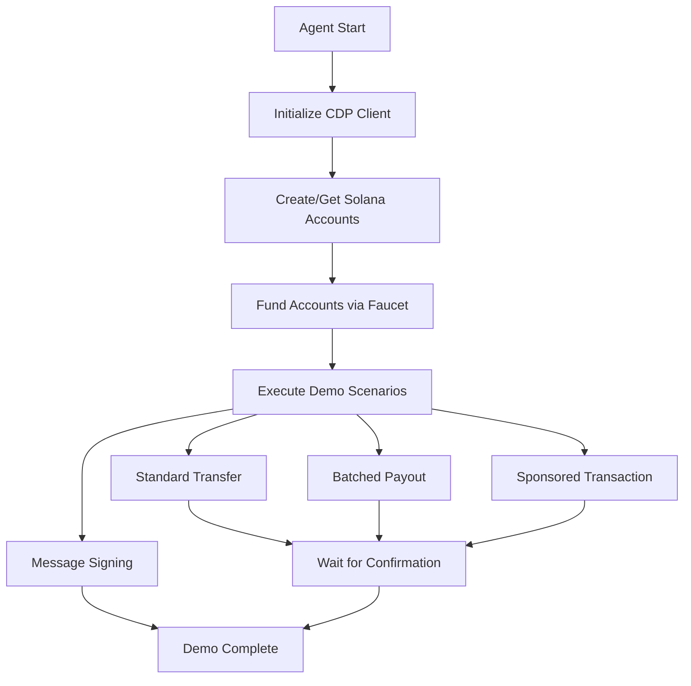

# CDP Wallets Solana Agent - Cross-Chain Operations

An autonomous TypeScript agent demonstrating Coinbase Developer Platform's Solana integration capabilities. This project showcases advanced Solana operations including account provisioning, funding, transactions, batch operations, sponsored transactions, and off-chain message signing.

## 🌟 Features

- **Automated Account Management**: Seamless Solana account creation and provisioning via CDP
- **Testnet Funding Integration**: Automatic SOL faucet requests with balance monitoring
- **Standard SOL Transfers**: Execute secure SOL transfers to any Solana address
- **Batched Transactions**: Efficient multi-recipient payouts in a single transaction
- **Sponsored Transactions**: Gasless UX with transaction fee sponsorship
- **Off-chain Message Signing**: Cryptographic proof of account ownership
- **Full TypeScript Implementation**: Type-safe development with Solana Web3.js integration
- **Real-time Transaction Monitoring**: Live confirmation tracking with explorer links

## 🛠️ Tech Stack

- **Node.js & TypeScript**: Modern JavaScript runtime with type safety
- **Coinbase CDP SDK**: Core Solana wallet and transaction management
- **Solana Web3.js**: Official Solana JavaScript SDK for blockchain interactions
- **Solana Devnet**: Safe testing environment for all operations
- **Dotenv**: Secure environment variable management

## 📋 Prerequisites

- Node.js (v18 or later)
- npm package manager
- Coinbase Developer Platform (CDP) API credentials
- Basic understanding of Solana blockchain concepts

## 🚀 Quick Start

### 1. Clone and Install

```bash
# Clone the repository
git clone https://github.com/HeimLabs/coinbase-cdp-demos.git
cd 15-CDP-Wallets-Solana-Agent

# Install dependencies
npm install
```

### 2. Environment Setup

Create a `.env` file in the root directory:

```bash
# Copy the example environment file (if available)
cp .env.example .env
```

Add your CDP API credentials:

```env
# Coinbase Developer Platform API Credentials
CDP_API_KEY_NAME=your_cdp_api_key_name
CDP_API_KEY_PRIVATE_KEY=your_cdp_api_private_key

# Optional: Solana RPC Configuration
SOLANA_RPC_URL=https://api.devnet.solana.com
```

### 3. Build and Run

```bash
# Build the TypeScript project
npm run build

# Run the main agent demo
npm start

# Or run the simplified Solana demo
npm run solana

# Or run in development mode (build + start)
npm run dev
```

## 🎯 How It Works

### Agent Demo Scenarios

The agent demonstrates five key Solana operations:

#### 1. Account Provisioning
```typescript
// Automatic account creation with CDP
const agentAccount = await cdp.solana.getOrCreateAccount({ 
  name: "MySolanaAgent-v2" 
});
console.log(`Agent account: ${agentAccount.address}`);
```

#### 2. Automated Funding
```typescript
// Request SOL from CDP faucet if balance is zero
if (balance === 0) {
  const faucetResp = await cdp.solana.requestFaucet({
    address: account.address,
    token: "sol",
  });
  console.log(`Faucet transaction: ${faucetResp.signature}`);
}
```

#### 3. Standard SOL Transfer
```typescript
// Send SOL to a recipient address
const transaction = new Transaction().add(
  SystemProgram.transfer({
    fromPubkey: new PublicKey(agentAccount.address),
    toPubkey: recipient,
    lamports: 0.0001 * LAMPORTS_PER_SOL,
  })
);

const result = await cdp.solana.sendTransaction({
  network: "solana-devnet",
  transaction: serializedTx,
});
```

#### 4. Batched Payouts
```typescript
// Execute multiple transfers in a single transaction
const payouts = [
  { to: recipient1, amount: 0.00005 * LAMPORTS_PER_SOL },
  { to: recipient2, amount: 0.00005 * LAMPORTS_PER_SOL },
];

const payoutInstructions = payouts.map(payout =>
  SystemProgram.transfer({
    fromPubkey: new PublicKey(agentAccount.address),
    toPubkey: payout.to,
    lamports: payout.amount,
  })
);
```

#### 5. Sponsored Transactions
```typescript
// Sponsor transaction fees for another user
transaction.feePayer = new PublicKey(sponsorAccount.address);

// Multiple signatures: user authorizes, sponsor pays fees
const userSignedTx = await cdp.solana.signTransaction({
  address: sourceAccount.address,
  transaction: serializedTx,
});

const finalSignedTx = await cdp.solana.signTransaction({
  address: sponsorAccount.address,
  transaction: userSignedTx.signedTransaction,
});
```

#### 6. Off-chain Message Signing
```typescript
// Cryptographic proof of account ownership
const message = `I am the owner of ${agentAccount.address} at ${new Date().toISOString()}`;
const { signature } = await agentAccount.signMessage({ message });
console.log(`Message signed: ${signature}`);
```

## 🔧 Technical Details

### Project Structure

```
15-CDP-Wallets-Solana-Agent/
├── src/
│   ├── agent.ts           # Main agent demo with all scenarios
│   └── solana.ts          # Simplified Solana operations demo
├── dist/                  # Compiled JavaScript output
├── package.json           # Project dependencies and scripts
├── tsconfig.json          # TypeScript configuration
└── .env                   # Environment variables (create this)
```

### Key Components

1. **CDP Client Integration**: Initializes Coinbase Developer Platform SDK
2. **Solana Connection**: Connects to Solana Devnet for blockchain operations
3. **Account Management**: Automated account provisioning and funding
4. **Transaction Builder**: Creates and serializes Solana transactions
5. **Signature Management**: Handles transaction signing via CDP
6. **Confirmation Tracking**: Monitors transaction status and confirmations

### Architecture Flow



## 💡 Use Cases

- **Cross-chain Operations**: Demonstrate Solana integration alongside EVM chains
- **Automated Treasury Management**: Multi-recipient payouts and treasury operations
- **Gasless UX Development**: Sponsored transactions for improved user experience
- **Identity Verification**: Off-chain message signing for authentication
- **Educational Purposes**: Learn Solana development with CDP integration
- **Bot Development**: Automated trading and interaction agents

## 🔧 Customization

### Adding New Operations

Extend the agent with additional Solana features:

```typescript
// Example: SPL Token Transfer
import { TOKEN_PROGRAM_ID, getAssociatedTokenAddress } from '@solana/spl-token';

async function transferSPLToken(fromAccount: any, toAddress: PublicKey, amount: number) {
  const mintAddress = new PublicKey('your_token_mint_address');
  
  const fromTokenAccount = await getAssociatedTokenAddress(
    mintAddress,
    new PublicKey(fromAccount.address)
  );
  
  const toTokenAccount = await getAssociatedTokenAddress(
    mintAddress,
    toAddress
  );
  
  // Build SPL token transfer instruction
  // ... implementation
}
```

### Configuring Networks

Switch between Solana networks:

```typescript
// Mainnet
const connection = new Connection("https://api.mainnet-beta.solana.com");

// Testnet
const connection = new Connection("https://api.testnet.solana.com");

// Local
const connection = new Connection("http://localhost:8899");
```

### Custom Recipient Addresses

Update recipient addresses in the demo:

```typescript
// Replace with your own addresses
const recipient1 = new PublicKey("YourSolanaAddress1");
const recipient2 = new PublicKey("YourSolanaAddress2");
```

## 🛠️ Development

### Available Scripts

- `npm run build`: Compile TypeScript to JavaScript
- `npm start`: Run the main agent demo
- `npm run solana`: Run the simplified Solana demo
- `npm run dev`: Build and run in development mode
- `npm test`: Run tests (when available)

### Debug Mode

Enable detailed logging by setting environment variables:

```bash
DEBUG=true npm start
```

### Adding Tests

Create tests for your Solana operations:

```typescript
// Example test structure
describe('Solana Agent', () => {
  test('should create account successfully', async () => {
    const account = await cdp.solana.getOrCreateAccount({ name: 'test' });
    expect(account.address).toBeTruthy();
  });
});
```

## 🚀 Production Considerations

### Security Best Practices

1. **Environment Variables**: Store all sensitive keys in environment variables
2. **Network Selection**: Use mainnet only for production deployments
3. **Amount Validation**: Implement proper validation for transaction amounts
4. **Rate Limiting**: Add rate limiting for API calls and transactions
5. **Error Handling**: Comprehensive error handling and retry logic

### Monitoring and Logging

```typescript
// Add comprehensive logging
console.log(`[${new Date().toISOString()}] Transaction sent: ${signature}`);

// Monitor account balances
setInterval(async () => {
  const balance = await connection.getBalance(new PublicKey(address));
  console.log(`Current balance: ${balance / LAMPORTS_PER_SOL} SOL`);
}, 30000);
```

### Performance Optimization

1. **Connection Pooling**: Reuse Solana RPC connections
2. **Batch Operations**: Group multiple operations when possible
3. **Caching**: Cache account information and metadata
4. **Async Operations**: Use Promise.all for parallel operations

## 📖 Additional Resources

- [Coinbase Developer Platform Documentation](https://docs.cdp.coinbase.com/)
- [Solana Documentation](https://docs.solana.com/)
- [Solana Web3.js Documentation](https://github.com/solana-foundation/solana-web3.js)
- [Solana Explorer (Devnet)](https://explorer.solana.com/?cluster=devnet)

## 🔒 Security Notes

- This demo operates on Solana Devnet with test tokens only
- Never commit private keys or API credentials to version control
- Review all transaction parameters before executing on mainnet
- Implement proper access controls for production deployments
- Monitor for unusual activity and implement alerting

## 🤝 Contributing

Contributions are welcome! To contribute:

1. Fork the repository
2. Create a feature branch (`git checkout -b feature/solana-feature`)
3. Commit your changes (`git commit -m 'Add Solana feature'`)
4. Push to the branch (`git push origin feature/solana-feature`)
5. Open a Pull Request

## 📄 License

This project is licensed under the MIT License - see the [LICENSE](LICENSE) file for details.

---

**Disclaimer**: This project is for demonstration and educational purposes. Always test thoroughly on devnet before using mainnet. Solana operations involve transaction fees and potential loss of funds if misconfigured.

---

Built with ❤️ using [Coinbase Developer Platform](https://docs.cdp.coinbase.com/) and [Solana Web3.js](https://github.com/solana-foundation/solana-web3.js).
